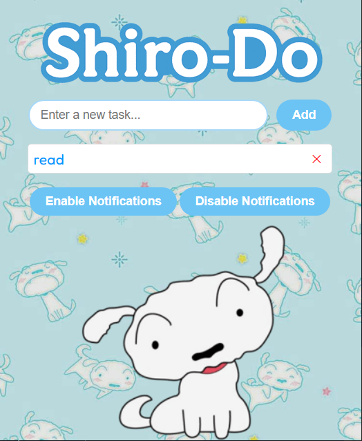

## Shiro Do : A To-Do list Chrome Extension

Shiro-Do is a lightweight, playful to-do list extension designed to help you stay productive while keeping things fun. The extension lets you quickly add, check off, and delete tasks with a single click. When you mark a task as complete, it updates in real-time. It also provides a notification system at equal intervals of time you set. Whether you’re a student, developer, or just someone who needs a little push, Shiro reminds you in a friendly way: “You can do it!”

Acess the extension here: [Chrom Web Store](https://chrome.google.com/webstore/detail/phmnmcnohcahdkckofcgbleoknjdlkcc) 

# Demo :

  

